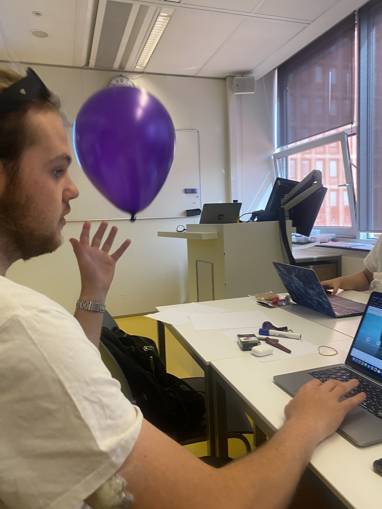
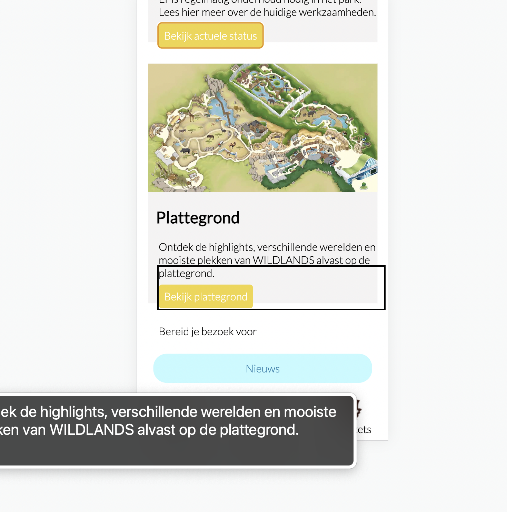
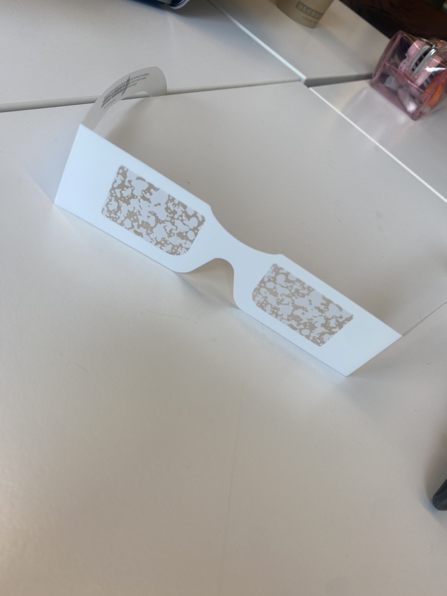
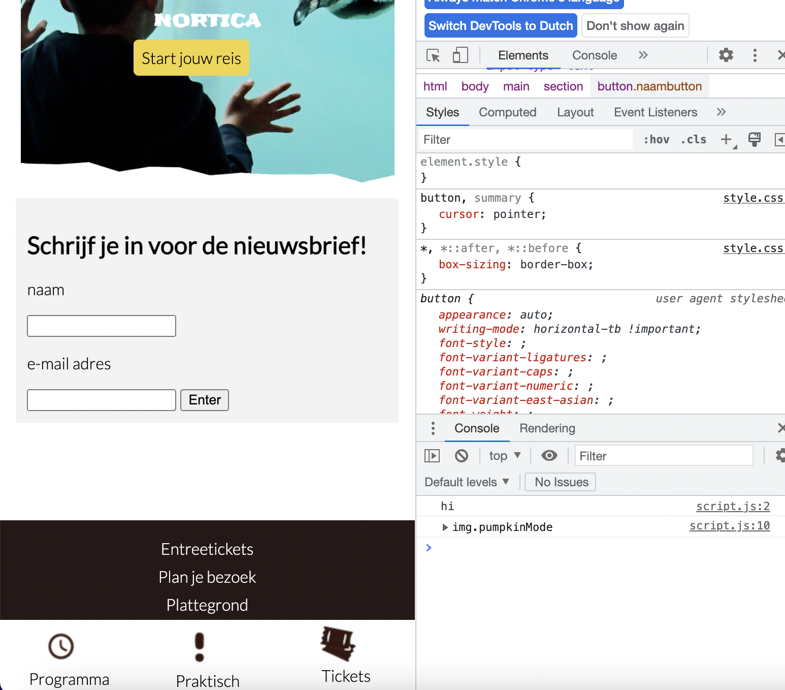

# Procesverslag
Markdown is een simpele manier om HTML te schrijven.  
Markdown cheat cheet: [Hulp bij het schrijven van Markdown](https://github.com/adam-p/markdown-here/wiki/Markdown-Cheatsheet).

Nb. De standaardstructuur en de spartaanse opmaak van de README.md zijn helemaal prima. Het gaat om de inhoud van je procesverslag. Besteedt de tijd voor pracht en praal aan je website.

Nb. Door *open* toe te voegen aan een *details* element kun je deze standaard open zetten. Fijn om dat steeds voor de relevante stuk(ken) te doen.

## Jij

  
uitwerken voor kick-off werkgroep

  ### Auteur:
  Lindsey Horn

  #### Je startniveau:
  Blauw

  #### Je focus:
 Surface plane
 

## Je website

  
uitwerken voor kick-off werkgroep

  ### Je opdracht:
  link naar de website die je gaat namaken óf de naam/omschrijving van je eigen ontwerp
https://www.wildlands.nl/ Deze site ga ik namaken. Ik ga verder er een eiegen draai aan geven door verschillende elementen toe te voegen.
  

  #### Screenshot(s) van de eerste pagina (small screen): 
  Wildlands home pagina 
  

  #### Screenshot(s) van de tweede pagina (small screen):
  Wildlands tickets pagina
  
  
 

## Toegankelijkheidstest 1/2 (week 1)

  
uitwerken na test in 1e werkgroep

  ### Bevindingen
  Lijst met je bevindingen die in de test naar voren kwamen:
- buttons wat groter maken
- tekst niet te klein
- gekleurde knoppen
- plaatjes ter ondersteuing helpen

  #### Screenreader
  Hier korte omschrijving (met indien nodig afbeeldingen)
  Met de screenereader op de originele site deed jhij deader links letter voor letter, en ook las hij regel voor regel voor en niet zin voor zin, waardoor het lastig is om het verhaal in goede zinnen te kunnen beluisteren en te begrijpen wat nou 1 zin is en wat niet.

  Hier een omschrijving van hoe het opgelost kan worden (met indien nodig afbeeldingen)
een goed gestructureerde HTML pagina.

  #### Muis en Toetsenbord 
  Hier korte omschrijving (met indien nodig afbeeldingen)
De tap toets op het toetsenbord gaat wel goed. Dit is duidelijk en overzichtelijk.

  #### Motoriek (shocks, elastiekjes)
  
  Hier korte omschrijving (met indien nodig afbeeldingen)
Ballon voor concentratie:
- je doelen zijn worden veel slomer uitgevoer, maar het is uiteindelijk wel gelukt
- hoofdingen moeten belangrijk zijn en echt opvallen zodat je dat als eerst opvalt en je niet heel lang hoeft te kijken waar je moet zijn.
- buttons zijn beetje klein en is lastig te klikken als je bezig bent met de ballon omhoog houden.

elastiekjes:
- scrollen is lastig
- typen gaat moeizamer
- in en uit-zoemen

  Hier een omschrijving van hoe het opgelost kan worden (met indien nodig afbeeldingen)
  - grotere gekleurde knoppen, heirdoor vallen ze gelijk op
  - plaatjes ter ondersteuining, dat werkt beter dan tekst op een korte tijd

  #### Visueel (brillen, contrast, kleurenblind, dark/light). 
  Hier korte omschrijving (met indien nodig afbeeldingen)

- je moet soms inzoemen anders kun je het niet lezen
- kost meer tijd om iets te vinden
- bril met kelurencontarst was wel goed, het contrast van de website was er goed.

  Hier een omschrijving van hoe het opgelost kan worden (met indien nodig afbeeldingen)
  - letters wat groter
  - makkelijk kunnen in en uitzoemen
  - goed kleurencontrast

## Breakdownschets (week 1)

  
uitwerken na afloop 2e werkgroep

  ### de hele pagina: 
  Ik ben helaas vergetewn fotos van de website van het proces te maken.
  In de eerste week ben ik eerst van de home pagina een creenshot gaan maken en vanuit daar bekijken hoe de HTML opgebouwd moet worden. Toen ik dat in XD had gedaan kon in zo gelijk mijn HTML structuur typen. Het is natuurlijk nog niet gestylt met CSS dus allesz ziet er nog niet uit. 

  ### dynamisch deel (bijv menu): 
  Ik ben begonnen met het menu maken en positioneren. Het lastigste was om het logo op de voorgrond te krijgen ook T.o.v. de video er gelijk onder. Ik heb ervoor gezorgd dat het filmpje op de home pagina blijft afspelen net als op de originele site.

  ### wellicht nog een dynamisch deel (bijv filter): 
  Ik zat deze week ik een goeie werkflow. Ik heb de hele pagina gestylt behalve de footer. Alles staat goed op zn plek (voor telefoon formaat dan)

## Voortgang 1 (week 2)

  
uitwerken voor 1e voortgang

  ### Stand van zaken
  hier dit ging goed & dit was lastig (neem ook screenshots op van delen van je website en code)

Ik heb mijn eerste pagina zo goed als af gekregen. Ik was al erg trots op heo ver ik voor die week al was gekomen. Dit gaat me later ook helpen.
  ### Agenda voor meeting
  samen met je groepje opstellen

  | student 1      | student 2 ik          | student 3    | student 4        |
  | ---            | ---                | ---          | ---              |
  | bespreekt zijn | bespreekt de site  | stelt ook    |    |
  | website en     | kijkt naar de      | zijn vragen  |  |
  | stelt vragen   | opbouw van HTML    | ...          | ...              |

  ### Verslag van meeting
  hier na afloop snel de uitkomsten van de meeting vastleggen

  - logo in de header moet een h1 worden
  - wat ik had als H1 moet een H2 worden
  - werken met var kleuren
  - section had ik 3 afbeeldingen met tekst eronder dat linkjes waren. dat is dat stukje oinder de video, dat moet ik veranderen in 1 link dus afbeelding en tekst in 1
  - 2e pagina moet tickets reserveren de H1 wel zijn en neit meer het logo
  - mag 2 CSS bestanden gebruiken voor de styling

## Voortgang 2 (week 3)

  
uitwerken voor 2e voortgang

  ### Stand van zaken
  hier dit ging goed & dit was lastig (neem ook screenshots op van delen van je website en code)
Ik heb deze week mijn 2e pagina ook geschreven met HTML en CSS en de footer ook gemaakt. die ahd ik vorige week nog niet. 
ik ben begonnen met kijken wat ik ging doen en heb gekozen voor die surface plane. Ik ben begonnen met het maken van een darkmode. en daarna ben ik begonnen met het maken van een halloween mode. Dit heb ik emt stukjes JS gedaan. 

  ### Agenda voor meeting
  samen met je groepje opstellen

  | student 1      | student 2          | student 3 ik            | student 4        |
  | ---            | ---                | ---                     | ---              |
  | stelde vragen  | besprak ook  zijn  | gevraagd naar stukje JS | en dan ik dat    |
  | aan 1 van de   | punten             | voor de halloween mode  | dit wil ik zeker |
  | studentassistenten| ...              | kwam daar nog niet uit | ...              |

  ### Verslag van meeting
  hier na afloop snel de uitkomsten van de meeting vastleggen

  -  ik was goed op gang
  - zag er netjes uit
  - JS werd ik geholpen en nu werkt de halloween mode en snpa ik het
  - op dit tempo vergaan

## Toegankelijkheidstest 2/2 (week 4)

  
uitwerken na test in 8e werkgroep

  ### Bevindingen
  Lijst met je bevindingen die in de test naar voren kwamen (geef ook aan wat er verbeterd is):
- alt-tekst bij afbeeldingen toevoegen
- likjes makkelijk aan te klikken
- kleuren contrast is goed, goed gekozen kleuren.
- was verast hoe goed het testen eigenlijk ging

  #### Screenreader
  Hier korte omschrijving (met indien nodig afbeeldingen)
- mijn website werkte goed met de screenreader. hij las alles netjes voor. 
- hij las wel heel snel, maar dat ligt denk ik aan de instellingen.
- linkjes snapt hij allemaal
- afbeeldingen nog niet genoemd
- vakje om het item staat verkeerd

  Hier een omschrijving van hoe het opgelost kan worden (met indien nodig afbeeldingen)
  - ik moet nog alt-teksten toevoegen

  #### Muis en Toetsenbord 
  Hier korte omschrijving (met indien nodig afbeeldingen)

  
- de tap-toets deed het erg goed, hij apkte alle linkjes en alle knoppen. die waren allemaal bereikbaar.
- vakje om het item staat verkeerd

  #### Motoriek (shocks, elastiekjes)
  Hier korte omschrijving (met indien nodig afbeeldingen)

shocks:
standje 3/4 kon ik er nog wel goed mee omgaan. scrollen is wel wat lastiger. het duurt iets langer voordat je ergens anders op ene pagina bent. button grootte was wel goed. Ik kon ze namelijk wel aanklikken. kleine linkjes zijn alleen wel lastig.

  Hier een omschrijving van hoe het opgelost kan worden (met indien nodig afbeeldingen)
- linkjes groter oppervalk om op te klikken

  #### Visueel (brillen, contrast, kleurenblind, dark/light). 
  
  Hier korte omschrijving (met indien nodig afbeeldingen)
  met de eerste bril die met de gele glazen, was alles goed te lezen en het kleurencontrast goed.
  bril 2 met de witte velkjes, werd al iets lastiger maar het was voor mij nog steeds te lezen en te begrijpen.

  met de instellignen in de browser hebben we getest met verschillende soorten kleuren blind. Hierdoor kwam ik erahcter dat de kleurencontrasten goed blijven en het nog overzichtelijk is.

  Hier een omschrijving van hoe het opgelost kan worden (met indien nodig afbeeldingen)
  - duidelijke kleuren
  - duidelijke knoppen 
  tekst niet te klein

## Voortgang 3 (week 4)

  
uitwerken voor 3e voortgang

  ### Stand van zaken
  hier dit ging goed & dit was lastig (neem ook screenshots op van delen van je website en code)

  ### Agenda voor meeting
  samen met je groepje opstellen

  | student 1      | student 2   ik                       | student 3    | 
  | ---            | ---                                  | ---          |
  | site           | Overige keuzes van                   | laatste kiekjes      | 
  | laatste kleine dingetjes| surface plane               | nog een punt | 
  | ...            | wat nog handig is om te doen         | ...          | ...              

  ### Verslag van meeting
  hier na afloop snel de uitkomsten van de meeting vastleggen

  - nog steeds alt-tekst toevoegen
  - kijken naar SVG plaatjes voor verder werken
  - ziet er al goed uit, en weet al meer dan 4 weken geleden
  - verschilende states uitwerken
  - bekijk beoordelingsformulier nog

## Eindgesprek (week 5)

  
uitwerken voor eindgesprek

  ### Je uitkomst - karakteristiek screenshots:
  

  ### Dit ging goed/Heb ik geleerd: 
  Korte omschrijving met plaatjes
- de opbouw van de HTML bedenken en vanuit dat structuur pas vormegevn. dit is erg goed gegaan en heeft ook goed geholpen.
- ik heb geleerd om animaties te maken, ook met SVG
- positioneren lukt steeds beter.
- planning en het bij houden ging erg goed
- ik heb geleerd hoe je beter kan werken met JS
- ik heb geleerd om met Var (root elemneten), te werken. Deze heb ik nooit gebruikt. Hierdoor ging het maken van de darkmode en halloweenmode goed.

  ### Dit was lastig/Is niet gelukt:
  Korte omschrijving met plaatjes
  - ik had geprobeerd een werkend formulier te maken voor het inschrijven van een neiuwsbrief en dat je dan pop up melding krijgt dat je bent aangemeld. dit lukte niet dus ik heb gespeeld met een SVG icon maken. Dit is wel gelukt, vond het alleen beetje apart dat het zoveel code had, maar ik dacht het zal wel goed zijn want het heeft gewerkt en mijn ontwerp in illustrator staat op mijn site.
  
  - soms was JS wel lastig, en kon in zelf de fout niet vinden , maar dat is gelukkig opgelsost door de docent of de student assistent.
  

## Bronnenlijst

  
continu bijhouden terwijl je werkt

  Nb. Wees specifiek ('css-tricks' als bron is bijv. niet specifiek genoeg).

  1. docent
  2. studentassisten

